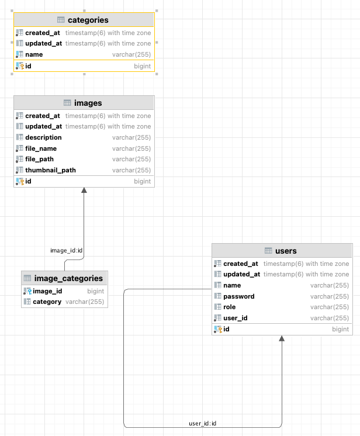

# Image Hub API Documentation

## Overview
이 프로젝트는 이미지 업로드, 조회, 수정, 삭제 및 사용자 인증을 지원하는 REST API를 제공합니다.  
API 문서는 아래의 Swagger UI에서 확인할 수 있습니다.  
[Swagger UI](http://localhost:8080/swagger-ui/index.html)

## Requirements

- **Java**: 17+
- **Spring Boot**: 3.4+
- **Database**: PostgreSQL
- **Maven**: 3.6+

---

## API Endpoints

### 1. 이미지 업로드
**POST** `/images`

Uploads an image with metadata (description and categories).

#### Request:
**Headers:**
```json
{
  "Authorization": "Bearer <JWT_TOKEN>",
  "Content-Type": "multipart/form-data"
}
```

**Body:**
```bash
-F 'file=@example.png;type=image/png' \
-F 'request={"description":"Sample Image","categories":["OTHERS"]}'
```

**cURL Example:**
```bash
curl -X 'POST' \
  'http://localhost:8080/images' \
  -H 'accept: */*' \
  -H 'Authorization: Bearer <JWT_TOKEN>' \
  -H 'Content-Type: multipart/form-data' \
  -F 'file=@example.png;type=image/png' \
  -F 'request={"description":"Sample Image","categories":["OTHERS"]}'
```

#### Response:
**Status 200:**
```json
{
  "message": "Image uploaded successfully"
}
```

---

### 2. 저장된 이미지 목록 조회
**GET** `/images`

Retrieve a list of all uploaded images.

#### Request:
**Headers:**
```json
{
  "Authorization": "Bearer <JWT_TOKEN>"
}
```

**Query Parameters:**
- `page`: (optional) Page number (default: 0)
- `size`: (optional) Number of images per page (default: 10)

**cURL Example:**
```bash
curl -X 'GET' \
  'http://localhost:8080/images?page=0&size=10' \
  -H 'accept: application/json' \
  -H 'Authorization: Bearer <JWT_TOKEN>'
```

#### Response:
**Status 200:**
```json
[
  {
    "id": 1,
    "fileName": "example.png",
    "description": "Sample Image",
    "categories": ["OTHERS"],
    "filePath": "uploads/example.png",
    "thumbnailPath": "thumbnails/thumb_example.png"
  }
]
```

---

### 3. 특정 이미지 조회
**GET** `/images/{id}`

Retrieve details of a specific image by its ID.

#### Request:
**Headers:**
```json
{
  "Authorization": "Bearer <JWT_TOKEN>"
}
```

**cURL Example:**
```bash
curl -X 'GET' \
  'http://localhost:8080/images/1' \
  -H 'accept: application/json' \
  -H 'Authorization: Bearer <JWT_TOKEN>'
```

#### Response:
**Status 200:**
```json
{
  "id": 1,
  "fileName": "example.png",
  "description": "Sample Image",
  "categories": ["OTHERS"],
  "filePath": "uploads/example.png",
  "thumbnailPath": "thumbnails/thumb_example.png"
}
```

---

### 4. 저장된 이미지 삭제
**DELETE** `/images/{id}`

Deletes an image by its ID.

#### Request:
**Headers:**
```json
{
  "Authorization": "Bearer <JWT_TOKEN>"
}
```

**cURL Example:**
```bash
curl -X 'DELETE' \
  'http://localhost:8080/images/1' \
  -H 'accept: application/json' \
  -H 'Authorization: Bearer <JWT_TOKEN>'
```

#### Response:
**Status 200:**
```json
{
  "message": "Image deleted successfully"
}
```

---

### 5. 특정 이미지의 카테고리 조회
**GET** `/images/{id}/categories`

Retrieve categories of a specific image by its ID.

#### Request:
**Headers:**
```json
{
  "Authorization": "Bearer <JWT_TOKEN>"
}
```

**cURL Example:**
```bash
curl -X 'GET' \
  'http://localhost:8080/images/1/categories' \
  -H 'accept: application/json' \
  -H 'Authorization: Bearer <JWT_TOKEN>'
```

#### Response:
**Status 200:**
```json
[
  "PERSON",
  "ANIMAL"
]
```

---

### 6. 이미지의 카테고리 추가
**POST** `/images/{id}/categories`

Add categories to an existing image.

#### Request:
**Headers:**
```json
{
  "Authorization": "Bearer <JWT_TOKEN>"
}
```

**Body:**
```json
["PERSON", "ANIMAL"]
```

**cURL Example:**
```bash
curl -X 'POST' \
  'http://localhost:8080/images/1/categories' \
  -H 'accept: application/json' \
  -H 'Authorization: Bearer <JWT_TOKEN>' \
  -H 'Content-Type: application/json' \
  -d '["PERSON", "ANIMAL"]'
```

#### Response:
**Status 200:**
```json
{
  "message": "Categories added successfully"
}
```

---

### 7. 이미지의 카테고리 삭제
**DELETE** `/images/{id}/categories`

Remove categories from an existing image.

#### Request:
**Headers:**
```json
{
  "Authorization": "Bearer <JWT_TOKEN>"
}
```

**Body:**
```json
["PERSON"]
```

**cURL Example:**
```bash
curl -X 'DELETE' \
  'http://localhost:8080/images/1/categories' \
  -H 'accept: application/json' \
  -H 'Authorization: Bearer <JWT_TOKEN>' \
  -H 'Content-Type: application/json' \
  -d '["PERSON"]'
```

#### Response:
**Status 200:**
```json
{
  "message": "Categories removed successfully"
}
```

---

### 8. 카테고리 추가
**POST** `/categories`

Add a new category.

#### Request:
**Headers:**
```json
{
  "Authorization": "Bearer <JWT_TOKEN>"
}
```

**Body:**
```json
{
  "name": "LANDSCAPE"
}
```

**cURL Example:**
```bash
curl -X 'POST' \
  'http://localhost:8080/categories' \
  -H 'accept: application/json' \
  -H 'Authorization: Bearer <JWT_TOKEN>' \
  -H 'Content-Type: application/json' \
  -d '{"name": "LANDSCAPE"}'
```

#### Response:
**Status 200:**
```json
{
  "message": "Category added successfully"
}
```

---

### 9. 카테고리 목록 조회
**GET** `/categories`

Retrieve a list of all categories.

#### Request:
**Headers:**
```json
{
  "Authorization": "Bearer <JWT_TOKEN>"
}
```

**cURL Example:**
```bash
curl -X 'GET' \
  'http://localhost:8080/categories' \
  -H 'accept: application/json' \
  -H 'Authorization: Bearer <JWT_TOKEN>'
```

#### Response:
**Status 200:**
```json
[
  {
    "id": 1,
    "name": "LANDSCAPE"
  }
]
```

---

### 10. 카테고리 삭제
**DELETE** `/categories/{id}`

Delete a category by its ID.

#### Request:
**Headers:**
```json
{
  "Authorization": "Bearer <JWT_TOKEN>"
}
```

**cURL Example:**
```bash
curl -X 'DELETE' \
  'http://localhost:8080/categories/1' \
  -H 'accept: application/json' \
  -H 'Authorization: Bearer <JWT_TOKEN>'
```

#### Response:
**Status 200:**
```json
{
  "message": "Category deleted successfully"
}
```

---

### 11. 사용자 로그인
**POST** `/auth/login`

Authenticate a user and generate a JWT token.

#### Request:
**Body:**
```json
{
  "userId": "admin",
  "password": "admin"
}
```

**cURL Example:**
```bash
curl -X 'POST' \
  'http://localhost:8080/auth/login' \
  -H 'accept: application/json' \
  -H 'Content-Type: application/json' \
  -d '{"userId": "admin", "password": "admin"}'
```

#### Response:
**Status 200:**
```json
{
  "token": "<JWT_TOKEN>"
}
```

---

### 12. 사용자 회원 가입
**POST** `/auth/signup`

Register a new user.

#### Request:
**Body:**
```json
{
  "userId": "newUser",
  "password": "password",
  "username": "New User",
  "role": "USER"
}
```

**cURL Example:**
```bash
curl -X 'POST' \
  'http://localhost:8080/auth/signup' \
  -H 'accept: application/json' \
  -H 'Content-Type: application/json' \
  -d '{"userId": "newUser", "password": "password", "username": "New User", "role": "USER"}'
```

#### Response:
**Status 200:**
```json
{
  "message": "User registered successfully"
}
```

---

## Notes
- 모든 엔드포인트는 `Authorization` 헤더에 유효한 JWT 토큰이 필요합니다.
- 토큰을 생성하려면 `/auth/login` 를 사용하세요.
  - 기본적으로 들어있는 계정: admin/admin (id/pw)

# Image Hub ERD



## TO-DO

### main
- response, exception handler - 예외 발생 시 JSON 형식으로 응답 반환 ({"error": "Invalid Token"})
- ROLE, Default category ENUM화, validation 추가

### test
- 만료 테스트 코드 추가
